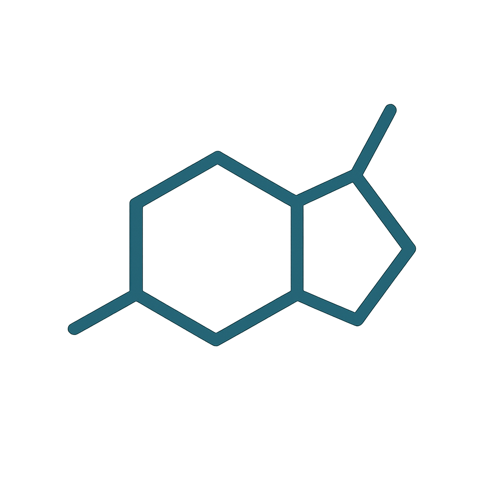

# nicotine

Nicotine is a Python library for detecting hallucinations in large language models (LLMs).

Just as clouds gather, rain falls, and streams fill the mystic lake, so does Nicotine distill clarity from the fog of LLM hallucination.

---

<div align="center">



[](https://www.python.org)
[](https://openai.com)
[](https://www.docker.com)
[](https://bandit.readthedocs.io/)

A next-gen, cybermantic hallucination detector for LLMs, inspired by the hydrological cycle and designed for both clarity and mystery.

[Getting Started](#getting-started) •
[Features](#features) •
[API Reference](#api-reference) •
[Development](#development) •
[Testing](#testing)

</div>

---

## 🌊 Overview

Nicotine is a modular Python library for hallucination detection in LLM output, guided by the Mystic Lake Protocol—a process inspired by the hydrological cycle. Designed for seamless integration, high reliability, and explainable results, Nicotine transforms LLM uncertainty into actionable insight.

---

## ✨ Mystic Lake Protocol

Nicotine's hallucination detection follows a 5-stage process inspired by the hydrological cycle:

1. **Evaporation** (Input Collection) — Capture and elevate LLM output for scrutiny.
2. **Condensation** (Preprocessing) — Remove noise, distill meaning, form the 'vessel' of testable ideas.
3. **Precipitation** (Fact Extraction) — Extract claims that fall out as distinct, testable facts.
4. **Percolation** (Verification) — Each fact is gently filtered and tested against trusted references, as water percolates through layers of earth.
5. **Runoff & Collection** (Synthesis) — Validated knowledge flows together in the Mystic Lake, producing a clear hallucination verdict and rationale.

Every step mirrors a real-world water phase, blending cybermantic symbolism with objective method.

---

## ✨ Features

- 🔍 **Hallucination Detection**
  End-to-end detection of factual, logical, and reference hallucinations in LLM output.

- ⚡ **Explainable Scoring**
  Each decision is traced, explained, and auditable at every protocol stage.

- 🧩 **Modular Integration**
  Use the full Mystic Lake pipeline or plug in specific stages into your workflow.

- 🛡 **Robust Validation**
  Static type checking, strict linting, security scans, and test coverage included.

- 🔮 **Configurable & Extensible**
  Easily customize reference checkers, extraction strategies, and scoring.

---

### Running as a FastAPI Service with Docker

Nicotine can also be deployed as a REST API server using FastAPI and Docker.

**To start the service:**

```bash
docker build -t nicotine-server .
docker run -p 8000:8000 --env-file .env nicotine-server
```

**This will launch the Nicotine FastAPI server at** `http://localhost:8000`.

#### Example: Basic Usage via HTTP

- `POST /detect` — Submit an LLM output and get hallucination analysis.

**Sample Request:**

```bash
curl -X POST http://localhost:8000/detect \
     -H "Content-Type: application/json" \
     -d '{"input": "Napoleon was 7 feet tall.", "references": ["Wikipedia", "Encyclopedia Britannica"]}'
```

**Sample Response:**

```json
{
  "summary": "Potential hallucination detected: Height of Napoleon is factually inaccurate.",
  "score": 0.92,
  ...
}
```

---

## 💻 Development

### Environment Setup

1. **Clone the repository**

   ```bash
   git clone <repository-url>
   cd nicotine
   ```

2. **Install dependencies**

   ```bash
   pip install -r requirements.txt
   ```

3. **Set up your environment variables**
   Create a `.env` file for API keys and settings:

   ```env
   OPENAI_API_KEY=your_key_here
   NICOTINE_CONFIG=./config/default.yaml
   ```

4. **Verify setup** (optional)

   ```bash
   python scripts/verify_setup.py
   ```

---

## 🔍 Code Quality Standards

Nicotine enforces the highest code quality and security standards:

- 🟦 **Static Type Checking:** Full type annotations, validated with MyPy.
- 📄 **Code Style:** Black formatting and Flake8 linting, strict docstrings.
- 🦺 **Security:** Bandit scans for common Python vulnerabilities.
- ✅ **Pre-commit Hooks:** All checks run before every commit.

---

## 🧪 Testing

- **Run all tests:**

  ```bash
  pytest
  ```

- **Code Quality Checks:**

  ```bash
  mypy nicotine/
  flake8 nicotine/
  bandit -r nicotine/
  ```

---

## 📚 API Reference

### Core Pipeline

- `nicotine.detect_hallucination(input: LLMInput) -> MLPResult`
  Runs the full Mystic Lake Protocol on the given LLM output.

- `nicotine.evaporation.collect(input: LLMInput) -> EvaporationResult`
  Capture and elevate LLM output.

- `nicotine.condensation.preprocess(input: LLMInput) -> CondensationPreprocessResult`
  Preprocess and distill meaning.

- `nicotine.precipitation.extract_facts(text: LLMInput) -> Facts`
  Extract testable facts/claims.

- `nicotine.percolation.verify(facts: Facts) -> FactsEvaluation`
  Gently filter and test facts against references.

- `nicotine.runoff.synthesize(output: LLMOutput) -> Synthesis`
  Produce the hallucination verdict and rationale.

\*_NOTE:_ `LLMInput` and `LLMOutput` represent the inputs and outputs from an LLM workflow step which is essentially one or more chained LLM calls.

### Example

```python
from nicotine import detect_hallucination

result = detect_hallucination(
    input="Napoleon was 7 feet tall.",
    references=["Encyclopedia Britannica", "Wikipedia"]
)
print(result.summary)
# Output: "Potential hallucination detected: Height of Napoleon is factually inaccurate."
```

---

## 🏗 Project Structure

```
nicotine/
├── nicotine/                # Main package
│   ├── __init__.py
│   ├── pipeline.py          # Core pipeline API
│   ├── evaporation.py       # Input collection
│   ├── condensation.py      # Preprocessing
│   ├── precipitation.py     # Fact extraction
│   ├── percolation.py       # Verification
│   ├── runoff.py            # Synthesis
│   └── utils/               # Utilities
├── scripts/                 # CLI and helper scripts
├── tests/                   # Unit/integration tests
├── examples/                # Example inputs/outputs
├── requirements.txt         # Python dependencies
├── setup.py                 # Packaging script
├── LICENSE
├── README.md
```

---

## 🔒 Security & Compliance

- API key security (never hard-coded).
- Role-based access (if using as a service).
- Audit logging (optional).
- Rate limiting (optional).
- Data encryption (if storing sensitive data).

---

## 🤝 Contributing

1. Fork and branch from `main`.
2. Make your changes.
3. Run quality checks: `pytest && mypy nicotine/ && flake8 nicotine/ && bandit -r nicotine/`
4. Submit a pull request.

---

## 📄 License

See [LICENSE](./LICENSE) for details.

---

<div align="center">
Made by Team Alpha.
</div>
